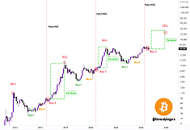
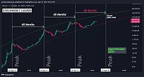
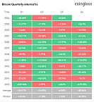
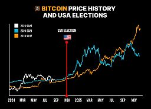
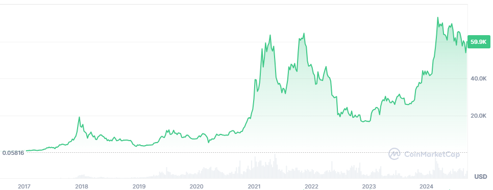
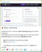
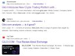
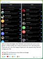
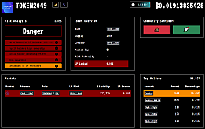
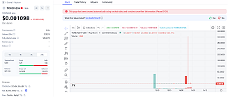

\page crypto Crypto

This page is about how to make money with crypto.  
Written by PRooF, using my own experience.  
!!! NFA and DYOR (Not Financial Advise and Do Your Own Research) !!!

Don't get lost on this page, use the Table of Contents, that's why it is there.

And never forget the most important rule: Never lose money. :)

[Quick link to my altcoins table.](https://docs.google.com/spreadsheets/d/1dRmWWfjfH5j3kHnVBlGKj25zNzYuv04kCtUuxtnEb2U/edit?usp=drive_link)

[TOC]

\section terms Terminology

 - **Fiat Currency:** real-world money such as HUF, USD, EUR. [More on Wikipedia.](https://en.wikipedia.org/wiki/Fiat_money)
 - **Blockchain:** a list of records securely linked together via cryptographic hashes. Examples: Ethereum, Tron, Solana. [More on Wikipedia.](https://en.wikipedia.org/wiki/Blockchain)
 - **Cryptocurrency:** digital currency using cryptography for managing transactions. Usually we just say: crypto. They live on a blockchain.
 - **Stable Coin:** a cryptocurrency pegged to another asset, such as a fiat currency or gold, to maintain a stable price. Examples: USDT, USDC. Some also treat Bitcoin as stable coin.
 - **Altcoin:** alternative coin, basically any other crypto coin/token which is neither stable coin nor Bitcoin.
 - **CA:** Contract Address: a public address of a smart contract, you can use to buy/sell tokens. [More on 1inch.](https://help.1inch.io/en/articles/5711414-what-is-the-difference-between-a-wallet-address-contract-address-and-a-private-key)
 - **CEX:** Centralized exchange where you can trade using the wallet provided by the exchange. [Jump to section.](#cex)
 - **DEX:** Decentralized exchange where you can trade using your own soft-wallet. [Jump to section.](#dex)
 - **KYC:** Know Your Customer: a bundle of security measures to fight against money loundering, stealing, etc., basically you have to identify yourself in various ways to the service provider.
 - **FOMO:** Fear of Missing Out, you think you miss the chance of a good opportunity and feel worried (even though most probably you won't miss anything and should buy LATER).
 - **HODL:** Mispelled form of "hold" that became a meme in 2013. [Read the story here.](https://www.investopedia.com/terms/h/hodl.asp) Note that holding involves not selling the asset even in tough times.
 - **Diamond Hands:** Investor holding highly volatile assets even during tough times.
 - **Paper Hands:** Investor selling assets at first sign of trouble.
 - **Dip:** A bigger drop in the price of a cryptocurrency, basically a good opportunity for buying!
 - **Eat the Dip:** Buy yourself in after the drop, so you get into a convenient selling position later.
 - **Ape (verb):** To ape: rapidly investing in a new or trending cryptocurrency, token, or DeFi project without conducting in-depth research or due diligence.
 - **Honeypot:** A coin is considered a honeypot if it cannot be sold after buy. Basically a trap prepared by the developer of the coin. Only developer can sell.
 - **Signal:** A trade signal is a trigger for action, either to buy or sell a security or other asset, generated by analysis. [More on Investopedia.](https://www.investopedia.com/terms/t/trade-signal.asp)
 - **FUD:** Fear, uncertainty, doubt. Tricky investor uses it as manipulative strategy to make other people sell their asset, so that its prices goes down and the investory can buy it low.
 - **Satoshi:** Satoshi Nakamoto is the pseudoname of the inventor of Bitcoin. Nobody knows how made Bitcoin. But Satoshi [has a statue in Budapest](https://www.statueofsatoshi.com/). There are [suspects though](https://coinmarketcap.com/academy/article/who-is-satoshi-nakamoto).
  
\section whybuy Why Buy?

To get RICH.  
If you are not an idiot, then it is not riskier than investing in stocks.  
REAL MEN are expanding their portfolio with crypto, not avoiding it.  
When there is a pandemic, a war or an economic breakdown, or any other bigger crysis, both the crypto- and stock market fall together anyway.

\section howmuch How Much to Buy?

The exact amount of money you wouldn't mind losing.  
A lot of noobs did put most of their salary into crypto because they heard it can go up to 10 times.  
And then by the end of the month they had to sell their crypto in loss because actually they needed that money to buy food and pay the bills.  
If you don't have game money then don't buy crypto.

**So only put in the money you would otherwise spend on drinks or other useless stuff.**  
Also, this is longer term investment, you should not expect big returns within a few weeks!

At the same time, you have to understand: you need money to make money. Small money will bring small money.  
You put in $100, not much chance of multiplying it by 10 easily. But, if you make 10x, you can consider yourself lucky, and it is still only $1000, you are still nowhere.  
Thus, you need to put in big money to make big money!

Later in this document I made a section about what to buy: I believe that for [Easy Level](#whatbuy_easy) and [Medium Level](#whatbuy_medium) you can invest more money with more safety than on other levels.

\section wherebuy Where to Buy?

\subsection revo Revolut

<table>
<tr><th>Pros<th>Cons
<tr><td>
Easiest, convenient. 
Relatively safe coins (e.g. not honeypot).
<td>
High Tx fees. 
Not all coins/tokens can be found here.
</table>

Not good for frequent trading because of the extra fees you are paying to Revolut for each transaction.  
But this one is the most convenient for a beginner. Suitable if you wanna keep your money in crypto for long-term (years) profits.  
Also, the coins listed here are more safe to buy, i.e. not tricking you into a honeypot, etc. Still, price is volatile, so be careful!  
As per my latest info there is no way to convert your crypto to other crypto but maybe they already implemented it in 2024.

\subsection cex CEX (Centralized Exchange)

<table>
<tr><th>Pros<th>Cons
<tr><td>
Less Tx fees. 
More coins/tokens can be found here. 
Can trade between coins without converting to/from fiat money in between. 
Relatively safe coins (e.g. not honeypot). 
Tools like trading bots, copy trading.
<td>
Registering takes some time (KYC). 
Sometimes you need to re-do part of KYC even when you want to send money into the CEX. 
Can suddenly disappear, so dont keep your money there long-term.
</table>

**Centralized crypto exchanges** offer various trading options including borrow (loan), bots, and probably more suitable for frequent trading.  
However, you still gonna pay some extra fee to the CEX but probably less than to Revolut.  
Some coins/tokens are available only thru CEX. Definitely broader range than on Revolut.

The biggest inconvenience is registering yourself and going thru the whole KYC process and properly securing your account before using it.  
I feel like there is even more security measures in place than in online banking.  
Once it is setup, it is easy.

Examples of recognized CEX are:
 - [Binance](https://www.binance.com/)
 - [Coinbase](https://www.coinbase.com/)
 - [KuCoin](https://www.kucoin.com/)
 - [Gate.io](https://www.gate.io/)
 - [Kraken](https://www.kraken.com/)

These exists for many years already and considered ok to use.

However, the general recommendation is NOT to keep your crypto there for long time but to withdraw it to your own crypto wallet.  
In CEX, you also have a wallet, owned by the CEX (it is NOT yours!), so if the CEX disappears, you won't have access to your wallet anymore.  
Such sudden disappears have already happened multiple times, examples:
 - [FTX crash](https://en.wikipedia.org/wiki/Bankruptcy_of_FTX)
 - [Mt. Gox crash](https://en.wikipedia.org/wiki/Mt._Gox)
 - [Suspending BitForex](https://www.coindesk.com/business/2024/07/19/bitforex-to-open-for-withdrawals-following-chinese-police-investigation/)
 
So the recommended WoW for CEX is:
 -# you make account on CEX;
 -# you buy crypto on CEX;
 -# and then you withdraw that crypto into your own crypto wallet to keep there long-term.

Anytime later if you want, you can send back (deposit) the crypto from your own crypto wallet to your CEX account, just dont keep your stuff in CEX for long term.

Since you can withdraw/deposit/trade your cryptocurrencies without involving fiat money in these exchanges, you save money on fees you cannot save using Revolut.

\subsection dex DEX (Decentralized Exchange)

<table>
<tr><th>Pros<th>Cons
<tr><td>
Minor Tx fees. 
Some coins/tokens can be found only here. 
Can trade between coins without converting to/from fiat money in between. 
If you have your soft wallet ready, you do not need to register on DEX.
<td>
Requires you to have your own soft-wallet. 
Trading safety is not ensured, you might buy a honeypot.
</table>

Unlike CEX, **decentralized exchanges** don't give you a wallet. You have to have your own crypto wallet that you connect to the DEX for trading.  
But as I already recommended for CEX WoW, you should have your own crypto wallet anyway.  
You cannot buy all coins/tokens on CEX, some are available only thru DEX.

However, if you are buying a coin/token on DEX which is not listed on a CEX, you should do additional verifications before buying. See [honeypot scam in later section](#scams_honeypot).

Examples of recognized DEX are:
 - [UniSwap](https://app.uniswap.org/) (Ethereum chain; Phantom and MetaMask are supported)
 - [PancakeSwap](https://pancakeswap.finance/swap) (BNB Chain primarily but works across multiple chains; MetaMask support)
 - [Jupiter](https://jup.ag/swap) (Solana chain; Phantom and MetaMask are supported)
 - [Raydium](https://raydium.io/swap/) (Solana chain; Phantom and MetaMask are supported, may lag with Phantom wallet so I use Jupiter instead)
 - [Osmosis](https://app.osmosis.zone/) (works across multiple chains; neither Phantom nor MetaMask is supported yet)

\section whenbuy When Buy?

They always say to buy low and sell high.  
But what is low and what is high?  
It is difficult to tell if the current price is low or high because we don't know what is the reference price.  
The following rules might help.

\subsection whenbuy_01 When: Rule 1: Mind the Global Sentiment

Always check the all-time price chart of the selected coin and find reference points matching with global events, such as:
 - beginning of a pandemic;
 - beginning of a war;
 - economic breakdown;
 - in general, when media is talking about crash of the crypto market.

This way you can get a clue about what would be a correct reference price of the coin and compare its current price to it.

Also, some other decisions also have influence on Bitcoin price, like [Fed (Federal Reserve) interest rate changes](https://www.stlouisfed.org/in-plain-english/the-fed-implements-monetary-policy), [halving events](https://halvingdates.com/), etc.

\subsection whenbuy_02 When: Rule 2: Aim for Local Low

Also, try to find shorter-term cycles in the price and try to time your buy when the current price seems to be at local low height.  
Example: [short-term cycles in SAD HAMSTER price](https://coinmarketcap.com/currencies/sad-hamster/).  
There were around 6 cycles between 2024 Jun and Sep where one could earn at least 6x~50% gains.  
Imagine you spent 100k HUF on HAMMY in Jun, then realize the total profit of ~1M HUF by the end of Sep!

\subsection whenbuy_03 When: Rule 3: Do NOT FOMO

I think most of my losses were because of FOMO-buys.  
I immediately lost a lot of money when I started crypto-trading at the beginning of 2022 because that was the WORST timing for entering the market.  
People made me believe at that time that I will miss the best chance so I entered. Few months later, I was in -80%.  
Why? Because I FOMO'd myself.

**Cryptocurrency prices are really volatile, what is expensive today will be cheap tomorrow and vice versa!**

Still, the lesson is hard to learn.  
So I made this separate section for this, to make sure I never do it again (I already did it many times even in 2024).

**FOMO will lead to losses instead of gains, so NEVER buy anything just because its price has already started going up.**  
This is one of the most difficult part because it is about controlling your emotion: the fear and worry of missing a good chance.  
Based on my experience you will just lose money and regret all the FOMO-buys.  
Patience with buying something always brings gains.

\section whatbuy What to Buy?

This question is both the easiest and most difficult to answer.

\subsection whatbuy_easy Easy Level

If you want to invest zero time in it and want nice gains, buy Bitcoin and hold (hodl) it for years.  
You can simply do this in Revolut too.  
You can see some possible historical gains in \ref btc_prices "the Example Bitcoin Trades table".  
This way, you cannot lose money!  
Keep Bitcoin even during tough times when you are in -50%!

As you can see in the below picture, Bitcoin gives three chances to buy before it goes parabolic:
 - The first is near the market bottom.
 - The second is a few months before the halving.
 - The last is right after the halving.

<table>
<tr><td><td><td><td>
<tr><td>BTC gives 3 chances<td>BTC 4-year cycles<td>BTC quarterly returns<td>BTC price history and USA elections
</table>

\subsection whatbuy_medium Medium Level

If you want to invest more time and want even nicer gains in shorter term (weeks/months), then you need to have more diverse crypto portfolio, with cryptocurrencies of different sectors of the crypto world.  
You should discover what altcoins are in the market and buy yourself in.  
Usually the crypto projects have a white paper that explains the aim of the project and how they are planning to achieve the goals, who are in the team, etc.  
Then using your investor vein, you can decide which project to invest in.  

However, **the sad truth is: most of the time the big gains are not brought by the best projects but by the current hype.**  
The current hype is like seasons: you don't want to see Christmas movie in the middle of summer, but maybe during winter.  
So, my recommendation is to always look around on Twitter, Telegram and try to understand what the current hype is about.

For example, spring and summer of 2024 was about meme coins, especially on the Solana blockchain, big hype resulted in bringing in a lot of money, resulting in even more hype and more money.  
Maybe it is late to invest them in Sep 2024, but who knows ...

An important thing is: **when BTC goes down, 99% else also goes down. If BTC goes up, they also go up.**  
But the gains and the loses can be even more higher with altcoins, compared to BTC. This is the reason why we also invest in altcoins.  
Also, not all altcoins are moving at the same time: it happens that a meme coin goes up, another does the same with 1-2 days delay, so this delay can be used to adjust your positions better.

**To minimize time invested, just buy and hold XRP and SDEX for medium-term (weeks/months), as an addition to your long-term BTC holding.**  
Take profit when you want, then buy the dip, and repeat the process forever.  
They are expected to be here with us for long time.  

You can also try **staking** which even exists in Revolut with cryptocurrencies: you lock some assets and expect passive income profit.

Also, I made a **[table of some altcoins](https://docs.google.com/spreadsheets/d/1dRmWWfjfH5j3kHnVBlGKj25zNzYuv04kCtUuxtnEb2U/edit?usp=drive_link)** that might be also in your interest.  
You can see in that document that I'm monitoring how their prices react to Bitcoin price.  
**I recommend short-term (weeks) cyclic trading with the top-row altcoins in [that table](https://docs.google.com/spreadsheets/d/1dRmWWfjfH5j3kHnVBlGKj25zNzYuv04kCtUuxtnEb2U/edit?usp=drive_link).**  

\subsection whatbuy_advanced Advanced / Difficult Level

Speculate to accumulate.  
The advanced level involves listening to **[signals and analyzing the charts](#signals)**.  
You can also try **daytrading** which is basically doing the same on daily basis. But this most probably leads to [what happened to Wojak when he tried it](https://www.youtube.com/watch?v=ZcexKILIH10&ab_channel=WagieWojak).

Also, you can try **trading bots** which are auto-trading using your assets, based on custom parameters.  
Such trading bots are available on CEX for free, you can also see setups of other users as well.  
And there are external trading bots also which can use your soft wallet to trade, in this case no CEX registration is needed.

\subsection whatbuy_degen Degen Level / Casino

Degen is the short form of degenerate.  
These levels of the crypto world are for degens who risk some money for big returns within a very short period of time (minutes/hours).  
If you think that trading normal crypto is gambling, you are wrong: this level is the real gambling.

\subsubsection whatbuy_degen_general Random Hints

Random hints on what to buy, what would be a good deal can come from various sources, including Twitter and Telegram.  
For example, there are Telegram groups where chart analysis predictions come regularly for various assets, and I can assure many of them actually predicts well.  
I'm not linking anything here, I'm not advertising any of them, ask me in person.

There are people out there who are making money by buying a token early and then involving additional people.  
If you are fast and see such marketing activity on Twitter, for example in case of a meme coin, AND by scanning twitter it looks like the marketing just started like 20-30 minutes ago, then you are still early, you can buy.  
Otherwise you are late and others will use you as their exit liquidity.

Even if a signal tells you should buy, mind [the global sentiment](#whenbuy_01). You may postpone your buy, if the market situation implies a further downtrend.

And always check the token with honeypot checkers, see [honeypot scam in later section](#scams_honeypot).

\subsubsection whatbuy_degen_pumpfun Pump Fun

On [PumpFun](https://pump.fun/) anyone can create a coin on the Solana blockchain and other users can invest.  
The idea is, once the market cap reaches a specific value, the coin becomes publicly tradeable on the [Raydium DEX](https://raydium.io/swap/).  
Then, the journey of the coin can continue, its market cap can further grow as outsiders also start buying it.  
This can work only if the coin has a good narrative, the developer(s) and the community is active around it, social media is properly used for marketing, etc.
A lot of good meme coins were born on this site.

There are 2 ways of making money here:
 - either **you make a coin** and gather supporters investing in enough money so it can go to [Raydium](https://raydium.io/swap/) (then your investment is multiplied by 15);
 - or **you are investing in a coin** made by someone else.

**As of Sep 2024, 99.99% of the coins made here are NOT genuine, NOT made to establish a good community, and try to rip off any investor within a few moments.**  
The creators of most coins here don't even want their coin to make it to [Raydium](https://raydium.io/swap/), just want a few people to invest and then rip them off ASAP.

Thus, if you want to make money by investing into someone's coin here, **the only good buying strategy is**:
 - list the coins whose dev is currently live streaming (that shows some effort from the creator);
 - if the market cap of the coin is shown below $15k, open its page (I don't really care about coins with already bigger MC here);
 - check the wallet distribution bubble map (even tho not much use nowadays, see #scams_pumpfun);
 - if you are seeing active trades, invest a minimum amount of money (e.g. 0.1-0.3 SOL);
 - as soon as the value of the coin has increased 10-20%, SELL.
 
Note that the usual fee for a trade here is only around 0.001 SOL, so you don't need to worry much about that.

This way, you can ensure the following:
 - you spend minimum time in making money (e.g. 10 minutes);
 - you exit with profit.

People will hate me for writing this, as this is not how this site is supposed to work, but I have aligned based on my negative experiences and I don't want to be someone else's exit liquidity anymore, that's it.

**If you do not sell as soon as you are in 10-20% profit, someone else will do, and you either have to wait much more time to be able to sell in profit, or eventually you will have to exit with loss.**  
[Remember what happened to Wojak when he tried day trading!](https://www.youtube.com/watch?v=ZcexKILIH10&ab_channel=WagieWojak)  

If you want, you can repeat the above process with the same coin at its next dip, if you think there still will be people buying.

Still, you can find some real projects here (0.01% of the coins here), which are unique and a community is formed on Telegram who take care of the marketing even after the coin hits [Raydium](https://raydium.io/swap/).  
In such rare occurrence of finding such, try to hold your investment in that coin and work together with the community in the marketing to bring in more and more people.

\subsubsection whatbuy_degen_sunpump Sun Pump

In Aug 2024 a similar website was born: [SunPump](https://sun.io/?lang=en-US#/pumpVote).  
The idea is the same, but this operates on the Tron blockchain, and its name comes from the creator of the blockchain (Justin Sun).  
A successful meme coin that was created here and reaching higher and higher prices in 2024 is [SunDog](https://coinmarketcap.com/currencies/sundog/) which is now also traded on the [Gate.io](https://www.gate.io/) CEX.

\subsubsection whatbuy_degen_crash Rocket Crash Games

I never tried these, so hopefully these are not scam!  
The classic rocket crash game also has its Solana-based versions where you can risk your Solana for possible big gains:
 - [Solana Crash](https://solanacrash.io/)
 - [CrashOut](https://crashout.fun/en-us/solana)

Note that there are other versions for other cryptocurrencies as well, use Google.

\subsubsection whatbuy_degen_cockfight Cock Fight Games

You can [bet on the winning cock](https://www.degencockfight.com/cockfight) using Solana.

\section whensell When Sell?

It depends on YOUR expectations of the coin.  
But here is my opinion.

\subsection whensell_btc Selling Bitcoin

We never sell Bitcoin. We hold it for life!  
But here are some example long-term gains with Bitcoin:

<table>
<caption id="btc_prices">Example Bitcoin Trades</caption>
<tr><th>Date of Buy<th>Entry<th>~ Duration of Hold<th>Date of Sell<th>Exit<th>~ Change
<tr><td align="right">Mar 1, 2017<td align="right">1k $<td>9 months<td align="right">Dec 18, 2017<td align="right">19k $<td>x19
<tr><td align="right">Mar 1, 2017<td align="right">1k $<td>1 year<td align="right">Apr 1, 2018<td align="right">7k $<td>x7
<tr><td align="right">Mar 1, 2017<td align="right">1k $<td>7 years<td align="right">Apr 14, 2024<td align="right">63k $<td>x63
<tr><td align="right">Nov 14, 2021<td align="right">64k $<td>1 year<td align="right">Nov 12, 2022<td align="right">17k $<td>x0.25 :(
<tr><td align="right">Nov 14, 2021<td align="right">64k $<td>2.5 years<td align="right">Mar 14, 2024<td align="right">73k $<td>x1.14 :|
<tr><td align="right">Nov 12, 2022<td align="right">17k $<td>1.5 years<td align="right">Mar 14, 2024<td align="right">73k $<td>x4
</table>

As you can see, if your entry timing is bad, you need to hold longer to have some gains.  
The morale of the story is: with Bitcoin, you can ALWAYS make some gains, even with bad entry!

Note that you should always buy and hold Bitcoin. Even if your first entry was bad, then wait for a big drop and buy MORE to bring down your average entry price.

There are some exceptional cases only when we are selling it.  
**Sell Bitcoin only when BOTH of the following conditions meet:**
 - your exit price is higher than your entry price;
 - you are planning to buy yourself back later i.e. you are selling now high to reinvest for even more later!
 
This is because Bitcoin is going to the Moon!

For example, I sold Bitcoin around $60k on Aug 3, 2024 because I sensed the negative global market sentiment being continued and expected the price to go down more.  
So a few days later it could be bought back at $50k.  
Selling Bitcoin must be temporal only.

\subsection whensell_alts Selling Altcoins

Again: it depends on YOUR expectations of the coin.  
Unlike Bitcoin, not all altcoins should be kept forever.  
Especially meme coins because I think those are flying for limited time only. They are great for making money, but not so great for holding them forever.  
Check [my altcoins table for reference prices](https://docs.google.com/spreadsheets/d/1dRmWWfjfH5j3kHnVBlGKj25zNzYuv04kCtUuxtnEb2U/edit?usp=drive_link) to have idea when they should be sold.

\section appendix Appendix

\subsection signals Chart Analysis and Signals

\subsubsection signals_charts Chart Analysis

This topic is not crypto specific, this is coming from the stock market but applies to crypto as well.  
This is basically the art and/or science of analysing charts and trying to understand the market from the charts, and try to predict the near future of price movement.  
You should also watch the [linked videos](#videos) having "Trading" in their title.

Also I want to mention one of my favourite stuff is the **Ichimoku cloud for predicting price movement**: [video](https://www.youtube.com/watch?v=9e7OUfKTw6Y&ab_channel=TheSecretMindset).

**Death Cross / Golden Cross**: it is about the 50-days MA (moving average) relative to the 200-days MA.  
Long story short: death cross is when the 200-days MA moves ABOVE the 50-days MA line on the price chart, indicating probable end of bearish trend.  
Golden cross: when the 200-days MA moves BELOW the 50-days MA line on the price chart, indicating bullish trend.  
If we are approaching the death cross, sell. If you missed it, you can still sell on the day of the death cross that often results in a temporal pump.  
Buying is recommended around the death cross when prices look really low.  
You can see example of this on Bitcoin chart: Aug 8 2024.  
For more details, [check out the related video](https://www.youtube.com/watch?v=_bidQGwez-0&ab_channel=Crypto4lightTrading).

Additional content:
 - [Stablecoin marketcap drives Bitcoin price?](https://www.tradingview.com/chart/BTCUSD/ikZclopW-Stablecoin-liquidity-is-king-Bitcoin-bullish-thesis/)
 - [BTC and M2 correlation and detecting BTC bull cycles](https://www.tradingview.com/chart/BTCUSD/HgSSjQqP-BTC-and-M2-correlation-and-detecting-BTC-bull-cycles/)
 - [Money Flow Divergence Indicator](https://medium.com/limitless-investor/358-return-per-trade-i-created-an-indicator-that-will-change-your-trading-forever-69824d8d0de3)

Needless to say, chart analysis should be tied together with understanding [the global sentiment](#whenbuy_01).

\subsubsection signals_signals Signals

Your chart analysis can also generate a buy or sell signal but you can also receive signals.

Signals can come from various sources, for example, Telegram groups. NEVER pay for signals or to become member of VIP groups!  
You can receive chart analysis based signals in free Telegram channels/groups too.  
I'm not going to recommend any specific on this page because I'm still not convinced if they are harmless enough but you can ask me in DM/PM.

Even if a signal tells you should buy, mind [the global sentiment](#whenbuy_01). You may postpone your buy, if the market situation implies a further downtrend.  

Note that such Telegram groups usually have quite a large number of members, so even posting the signal can cause change in the asset's price, since they have influence on buying and selling the asset.  
What I want to tell by this, is that just by posting a signal, influences the people to drive the price in the same direction as the signal predicts:  
if signal predicts increasing price, then crowds will be buying the same asset, which causes price increase, then we can say yes, the signal was right. :)

Always avoid pump groups where they say that a specific asset's price will be pumped at a specific time, I call it as [pump scam](#scams_pump_signal).

\subsection memes Memes

There are lot of types of memes, some of them are political.  
2024 was the year of memes born from [Matt Furie: Boy's Club](https://www.fantagraphics.com/products/boys-club?srsltid=AfmBOor1nhcrxat_thimbWedbrvMq4TIgOBvD27YqhWZKTSv16THEe9r) cartoon characters.  
Probably the biggest was Pepe which is even used for political reasons.  
There is a very good documentary about it: [Feels Good Man - IMDB](https://www.imdb.com/title/tt11394182/).

Also, this picture explains all the other frogs closely related to Pepe:

TODO add picture when I find it!

\subsection scams Scams

\subsubsection scams_copycat Copycat Scam

A copycat token is basically a token created with the same name, logo, etc. as an already existing token, so if someone is not careful enough, might accidentally buy the copycat token instead of the original.  
Usually the creator of the copycat token already bought themselves in, so after other people also bought themselves in accidentally, the creator simply sells their share with higher price.  
Worse case is if this copycat token is [a honeypot](#scams_honeypot).

\subsubsection scams_honeypot Honeypot Scam

Before buying a token on a DEX, we should check if the token is actually safe to trade.  
This safeness has nothing to do with the price, as the price is very volatile anyway.  
The danger is that the smart contract (the code behind the token) may prevent us from selling the token after buying it. It can do it in multiple ways.  
To avoid this to happen with us, before buying the coin/token, we should use honeypot checkers.  
I use these:
 - https://apespace.io/honeypot
 - https://www.coinscan.com/honeypot-detector (note that I think it wrongly tells the "Contract Renounced" because it shows "No" even for well-known and safe coins)
 - https://check.quillai.network/
 - https://de.fi/scanner/
 - https://honeypot.is/
 - https://rugcheck.xyz/ (specifically for Solana-based coins. Make sure most of the LP is locked, Mint Authority is "-", and all of the top holders are in with low percentage (max 4-5%) per holder).
 - https://www.solsniffer.com

\subsubsection scams_elonmuskgiveaway Elon Musk Crypto Giveaway Scam

It is multiple years old but still being used on various occasions. For example, when Donald Trump gave a speech on Bitcoin Conference in July 2024, there were multiple live streams on YouTube with this scam.  
This scam is about streaming a pre-recorded video about Elon Musk talking in front of the audience. The video is a deepfake, using Elon's voice and face faked to tell you that if you send Bitcoin or any other coin to their address, you will immediately get back double.  
Obviously the wallet address you are sending your coins to, is owned by the scammer, and you will never see your coins again.  
One such [fake YouTube channel is this](https://www.youtube.com/c/SamirAldby29), trying to fake Tesla's YouTube channel. Occasionally you can see the fake live video being streamed here.

\subsubsection scams_pumpfun Pump Fun Scams

In the older days of [Pump.Fun](#whatbuy_degen_pumpfun), there were a lot of original ideas turned into coins that could make a lot of profit for both the creator and the early investors.  
However, nowadays most coins there are made for ripping off people.  
So, in recent months the scammers had to come up with more sophisticated methods to make other people believe in the coin not being a scam.

**Bundled Wallets:** if the creator or anyone has a big share (>4%) of the owned tokens, there is a high risk of dropping the price of the coin by a single person selling all the owned tokens.  
In such case investory are not buying because of this fear.  
Thus, it has become nowadays common that a single person uses multiple wallets to buy low amount of tokens. There are tools nowadays which can make this convenient, and a single person can easily trade using many wallets at the same time.  
This way, for example, even though someone is holding 30% of the tokens using 10 wallets with only 3-3% each, nobody will know it.  
Also, this brings in another advantage: since more wallets are holding tokens, the token will look more tempting to buy because it will look like many people already invested in it.  
Unfortunately, we cannot exactly know how many people are holding the token, only the number of wallets is known.

**Pre-recorded Live Streams:** scammers realized they can earn the trust of people more easily if they are live streaming also on this site, especially with a web cam or their phone, showing themselves to the public.  
This is true, but unfortunately, some scammers are streaming pre-recorded videos, which are not really live.  
To make this even more real, the scammer or friends of the scammer write questions in the live chat, and the person in the video is answering these questions like it was really a real video, even though it is pre-recorded.  
Usually the person in the video is a cute girl, to gain more fools investing in the coin.

\subsubsection scams_arbitrage Alleged Exploit of Arbitrage Scam

This kind of scam is still being done in some Telegram channels.  
They explain to you that the difference in price of a token on different crypto exchanges can be used to earn money:  
you buy a token for a relatively lower price on exchange 1, transfer that token to exchange 2, and sell it there for a bit higher price.  
Obviously, exchange 2 is a FAKE exchange. However, this scam is very sophisticated. I've been watching this happening for months.  
Recently, they even posted articles on medium.com about the start of such exchanges, which eventually are fake exchanges, owned by the scammer.  
Transferring money there is actually sending money directly to the scammer's wallet.

Example: such recent fake exchange is Gilci.  
They even prepared fake articles and reviews that Google can find, [example](https://www.streetinsider.com/Globe+PR+Wire/Gilci+Introduces+New+Crypto+Trading+Platform+with+Advanced+Features+and+Enhanced+Liquidity/23741892.html).  
You can even find a ["true review" ( :D ) on Youtube](https://www.youtube.com/watch?v=INlCDVqW69Q&ab_channel=KandyWaldren).  
On [medium.com there are articles written by fake user](https://medium.com/@MichaelStewart3).

<table>
<tr><td><td><td><td>
<td><td>
<tr><td>A nice post before the signal<td>Another nice post before the signal<td>One more<td>Reminder before the signal<td>The signal post with video guide<td>The signal post with text guide
<tr><td><td>
<td><td>
<td><td><td>
<tr><td>Took a screenshot from the website, #1<td>Took a screenshot from the website, #2
<td>Google Hits on Gilci<td>Medium.com articles about Gilci
<td>Nice post from scammer<td>Fake feedbacks shown by scammer<td>Finishing post from scammer
</table>

\subsubsection scams_pump_signal Pump Signal Scam

This kind of scam is regularly done in some Telegram channels.  
They say they will pump up the price of a token with the help of other insiders, whales, marketing, and anyone willing to participate in the group can also take profit by buying the token.  
They would use the outsiders and FOMOers as their exit liquidity.  
However, nothing is true of this. There is a single person behind it who makes a token, buys in themselves, and then anyone else buying will be used as exit liquidity.  
The scammer unexpectedly does a rug pull just a few moments after the pump signal notification, when some people already put some money in.  
The following screenshots show an example of a recent rug pull:

<table>
<tr><td><td><td><td>
</table>

In the above pictures we can see the Telegram posts, the coin name comes exactly at 18:00 CET which is shown as 16:00 GMT in the TradingView chart picture.  
3 minutes after the signal, rug pull happened, only the scammer earned anything.

\subsection websites Websites

 - [CoinMarketCap (see prices, charts, track your portfolio, community)](https://coinmarketcap.com/)
 - [coinglass (similar to CoinMarketCap)](https://www.coinglass.com/)
 - [CoinGecko (similar to CoinMarketCap)](https://www.coingecko.com/)
 - [DexScreener (similar, but specialized for coins/tokens tradable on DEX)](https://dexscreener.com/)
 - [TradingView (for analysing charts)](https://www.tradingview.com/)
 - [Crypto Halving Dates](https://halvingdates.com/)
 - [Arkham Intel - Deanonymizing the blockchain](https://platform.arkhamintelligence.com/)
 - [Mi az a DePIN?](https://kriptoakademia.com/2024/03/09/bevezetes-a-depin-vilagaba)
 - [Trading Skills (Investopedia)](https://www.investopedia.com/trading-skills-and-essentials-4689654)
 - [Stablecoin marketcap drives Bitcoin price?](https://www.tradingview.com/chart/BTCUSD/ikZclopW-Stablecoin-liquidity-is-king-Bitcoin-bullish-thesis/)
 - [BTC and M2 correlation and detecting BTC bull cycles](https://www.tradingview.com/chart/BTCUSD/HgSSjQqP-BTC-and-M2-correlation-and-detecting-BTC-bull-cycles/)
 - [Money Flow Divergence Indicator](https://medium.com/limitless-investor/358-return-per-trade-i-created-an-indicator-that-will-change-your-trading-forever-69824d8d0de3)
 - [Merkle Tree Compression](https://www.metaplex.com/posts/expanding-digital-assets-with-compression-for-nfts)
 - [Render Network Migration Summary](https://github.com/rendernetwork/RNPs/blob/main/RNP-002.md)

\subsection videos Videos

 - [What are Smart Contracts in Crypto? (4 Examples + Animated)](https://www.youtube.com/watch?v=pyaIppMhuic)
 - [Crypto Coin vs Token (Differences + Examples)](https://www.youtube.com/watch?v=422HORNUfkU&ab_channel=WhiteboardCrypto)

 - [A pénz pszichológiája | Morgan Housel könyvösszefoglaló](https://www.youtube.com/watch?v=4mFZZJ3MVe4&ab_channel=Preprocessor)
 - [Miért nehéz pénzügyileg a magyaroknak? - Jaksity György @ Menta S02E05](https://www.youtube.com/watch?v=BH75kY_KSsc)

 - [When you try day trading](https://www.youtube.com/watch?v=ZcexKILIH10&ab_channel=WagieWojak)
 - [Every Trading Strategy Explained in 12 Minutes](https://www.youtube.com/watch?v=ZX-Tp4zgJYc&ab_channel=DataTrader)
 - [Death Cross and Golden Cross. Powerful Trading Signals for Market Trends](https://www.youtube.com/watch?v=_bidQGwez-0&ab_channel=Crypto4lightTrading)
 - [Ichimoku Trading Was Hard, Until I Found This Powerful Strategy (Cloud Trading Strategies)](https://www.youtube.com/watch?v=9e7OUfKTw6Y&ab_channel=TheSecretMindset)
 - [How To Read Price Action Using Candlestick Psychology (Trading Strategy)](https://www.youtube.com/watch?v=dU-I67JaJrc&ab_channel=TheSecretMindset)
 - [BEST Technical Analysis Blueprint For Day Trading (Full Course For Beginners)](https://www.youtube.com/watch?v=OpTLs-86qwQ&ab_channel=TheSecretMindset)

\subsection tax Paying Taxes

This is country specific, but for Hungary the rules are clearly written on the [web page of the National Tax and Customs Administration (NAV) here](https://nav.gov.hu/ado/szja/a-kriptougyletek-jovedelmenek-adozasa).
 
\section faq FAQ

\subsection wallet How to Get a Crypto Wallet?

There are soft- and hard wallets.  
It does not matter where/how you get your crypto, you should be able to transfer it to either a hard- or soft-wallet for long-term storage.  
Not all wallets support all blockchains, DYOR before buying!

**Hard wallets** are actual physical devices storing your wallet, they are considered the most secure.   
You buy it and set it up as per the vendor instructions.  
Examples:
 - [Ledger](https://www.ledger.com/)
 - [Trezor](https://trezor.io/)

**Soft wallets** are software where you can create and manage your cryptocurrency wallet.  
Usually they come in multiple forms, such as mobile app, browser extension, etc.  
Examples:
 - [MetaMask](https://metamask.io/)
 - [Phantom](https://phantom.app/)

\subsection wherecoin I Know which Coin to Buy, but Where can I Buy it?

I always check a price-tracking website such as [CoinMarketCap](https://coinmarketcap.com/) which lists all CEX and DEX where a specific coin can be traded.  
For example, in case of Bitcoin, you can find this info [under the chart in the "Bitcoin Markets"](https://coinmarketcap.com/currencies/bitcoin/) section.

\subsection anon Am I Anonymous in Crypto Trading?

No, even if they try to make you believe, you are not.  
In 2024 we are already late to trade anonymously in the crypto market due to the regulations and security measures they introduced in recent years to fight against money laundering.  
The path of your money between the crypto- and the real world is pretty much trackable and in case of an investigation they will trace it from start to finish.  
Furthermore, [Arkham Intel](https://platform.arkhamintelligence.com/) is actually matches wallet adresses with names!  
So it is better to play nicely and do not scam people. Also, do not try to hide it from your local tax authority.
